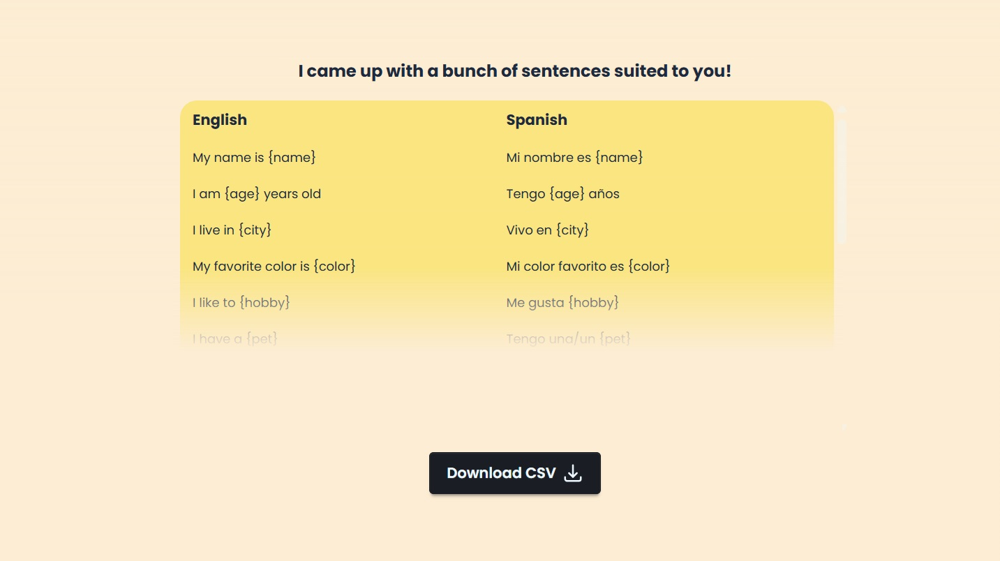

# Flashcard Generator for Language Learners

Small app that utilises the Gemini API to create flashcards based on a user's description about themselves. This means the first sentences a language learner will learn will be directly impactful to what they want to talk about.

Frontend written in React, backend done in Java Spring. You should get a gemini 1.5 flash API key and put it into the .env file.

